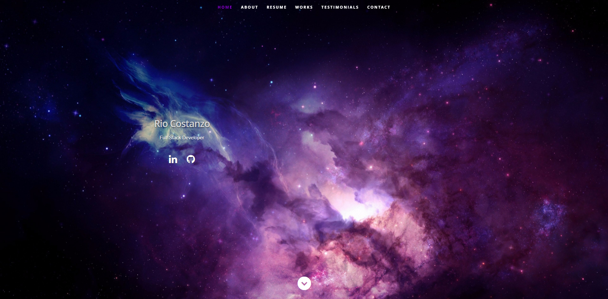

## React Portfolio

### Description

This is a portfolio designed with React to display contact information, previous works, testimonials, and social media links to those interested.

### Installation

Start this application by running `npm install` in the root directory to acquire necessary dependencies. Once that's done, `npm start`.

### Contact

Get in touch with me on [GitHub](https://github.com/rjcostanzo)